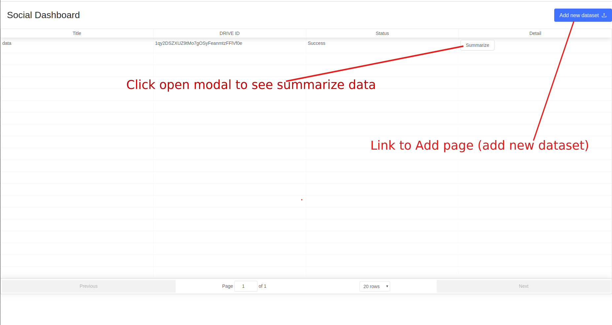
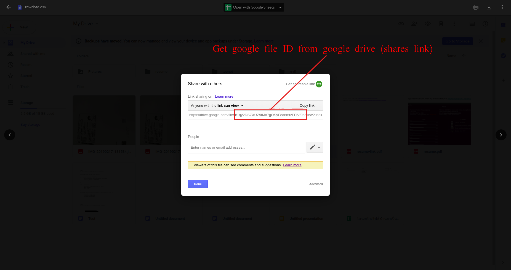
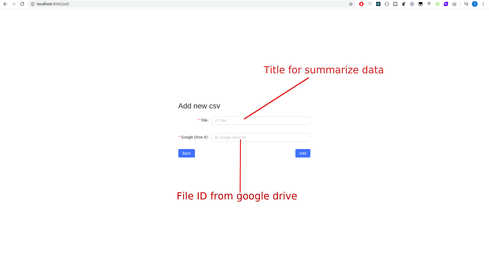

# Social Dashboard

### Prerequisites

1.docker
2.docker-compose

### Installing

pull this repository and then docker-compose up

### Start project

```
open http:localhost:8080 in your browser
```









